#### 3-Tier AWS Architecture

---

### Screenshot 1: Configure Terraform Provider

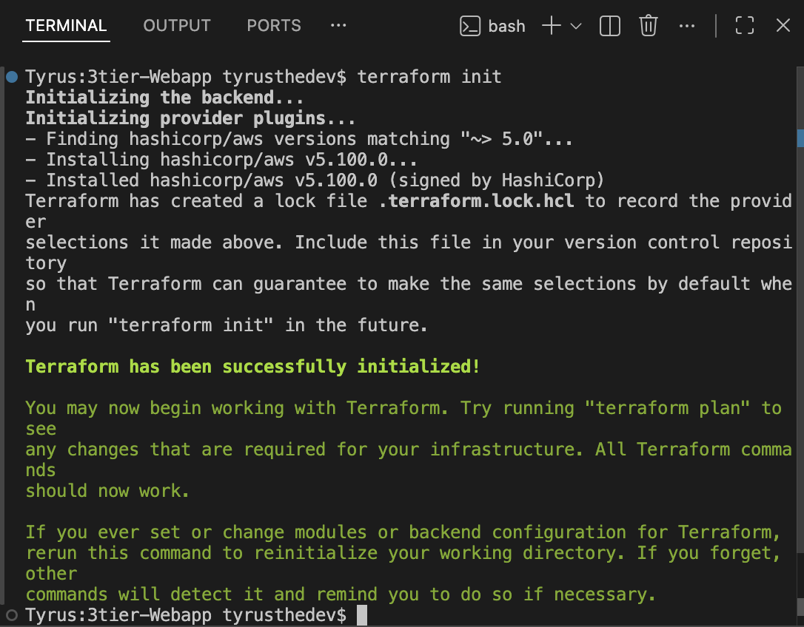

**What is shown:**  
Terraform initializes the AWS provider and downloads required plugins.

This ensures infrastructure is deployed consistently using Infrastructure as Code principles.

---

### Screenshot 2: Create the VPC

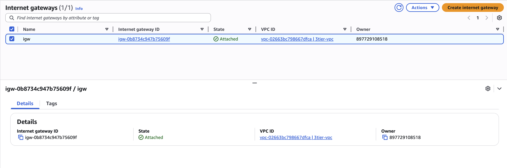

**What is shown:**  
The VPC isolates network resources.

The Internet Gateway allows public subnets to communicate with the internet.

CIDR 10.0.0.0/16 allows for subnet segmentation across tiers.

---

### Screenshot 3: Create Subnets Across 2 AZs

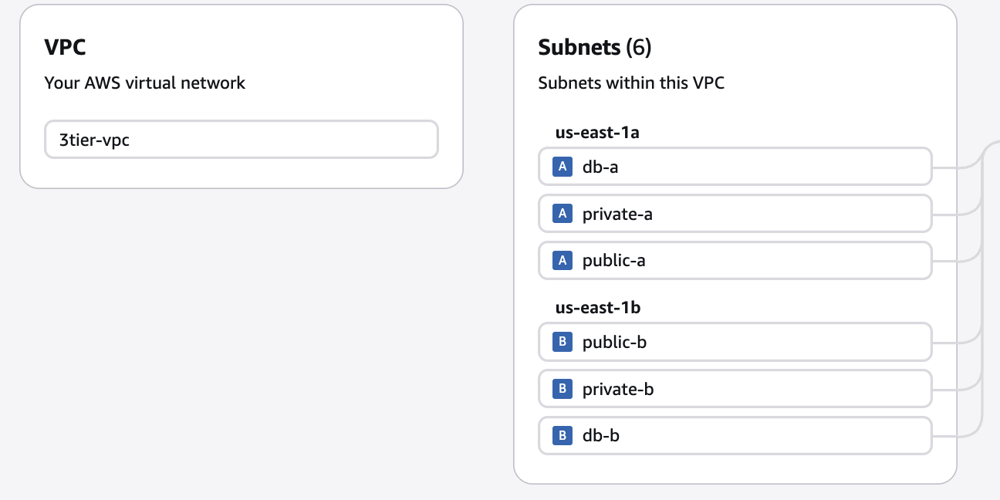

**What is shown:**  

Subnets are separated by function:
	•	Public subnets host ALB + NAT
	•	Private app subnets host EC2
	•	Private DB subnets host RDS

Deploying across 2 AZs ensures fault tolerance.

---

### Screenshot 4:  Configure Public Route Table

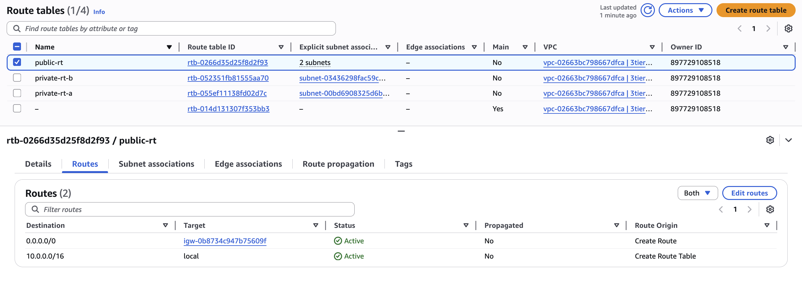

**What is shown:**  
Public subnets must route outbound traffic to the Internet Gateway.

This enables:
	•	ALB to receive traffic
	•	NAT Gateways to function
  
---

### Screenshot 5: Deploy NAT Gateways (High Availability)

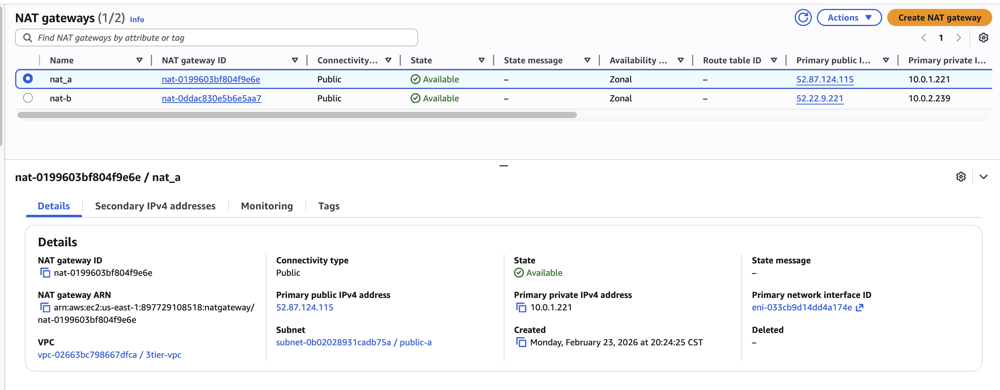
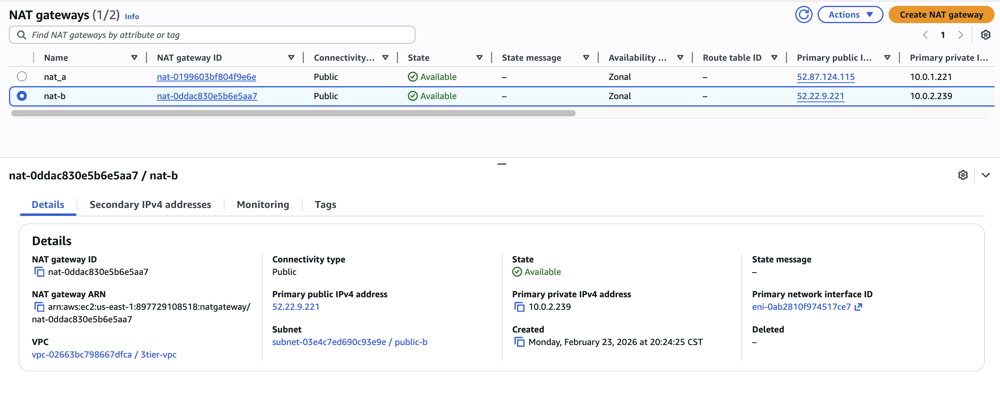
**What is shown:**  
Private subnets cannot access the internet directly.

NAT Gateways allow:
	•	OS updates
	•	Package installs
	•	Secure outbound communication

One NAT per AZ ensures high availability.

---

### Screenshot 6: Security Groups
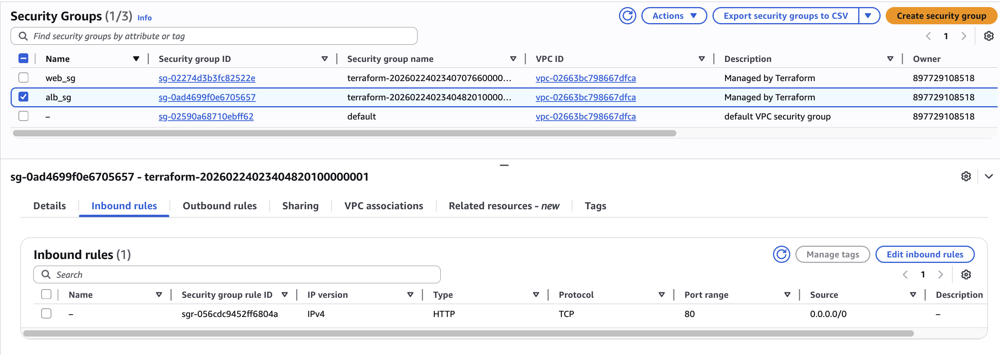

**What is shown:**  
Security groups enforce least privilege:
	•	ALB accepts HTTP from internet
	•	App tier only accepts traffic from ALB
	•	DB only accepts traffic from app tier

This prevents lateral exposure.

---

### Screenshot 7: ALB DNS name

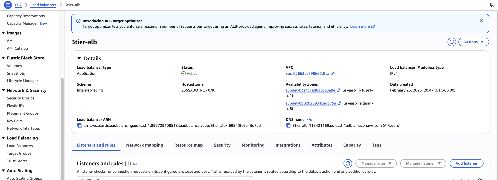

**What is shown:**  
The ALB:
	•	Distributes traffic across instances
	•	Performs health checks
	•	Provides a single public endpoint

It is the only internet-facing component.

---

### Screenshot 8: EC2 Instances (Private App Tier)

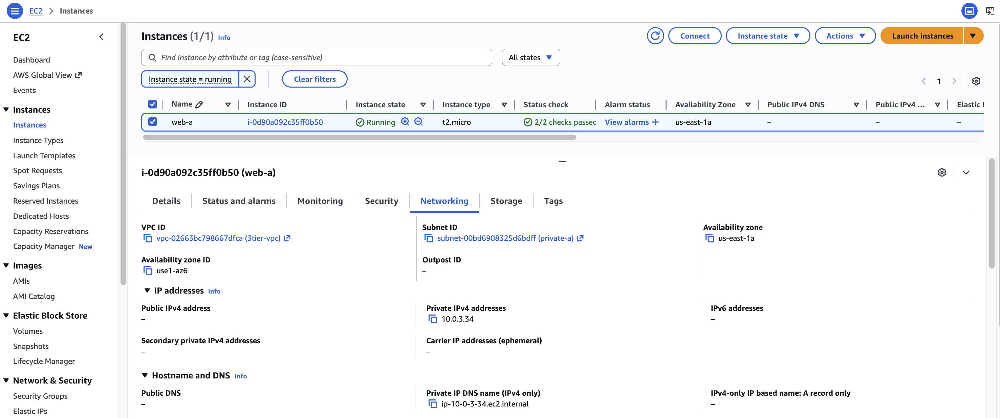

**What is shown:**  
Instances are deployed in private subnets.

They are not directly accessible from the internet.

Traffic flow:

Internet → ALB → EC2 → RDS

This is production-grade architecture.

---

### Screenshot 9: RDS Multi-AZ Deployment

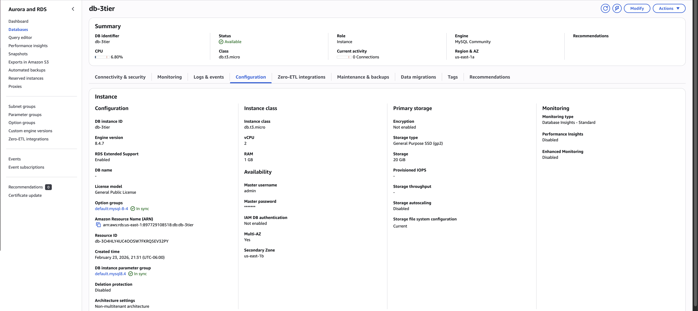
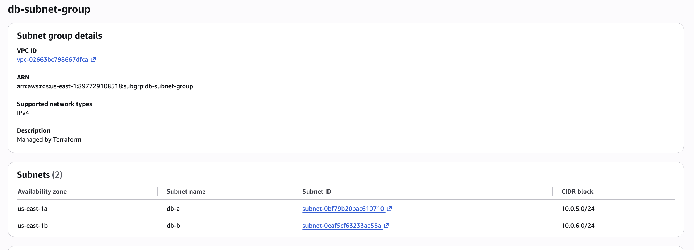

**What is shown:**  
Multi-AZ ensures:
	•	Automatic failover
	•	High availability
	•	Production readiness

Database is isolated in private subnets.

---

### Screenshot 10: Deploy Infrastructure

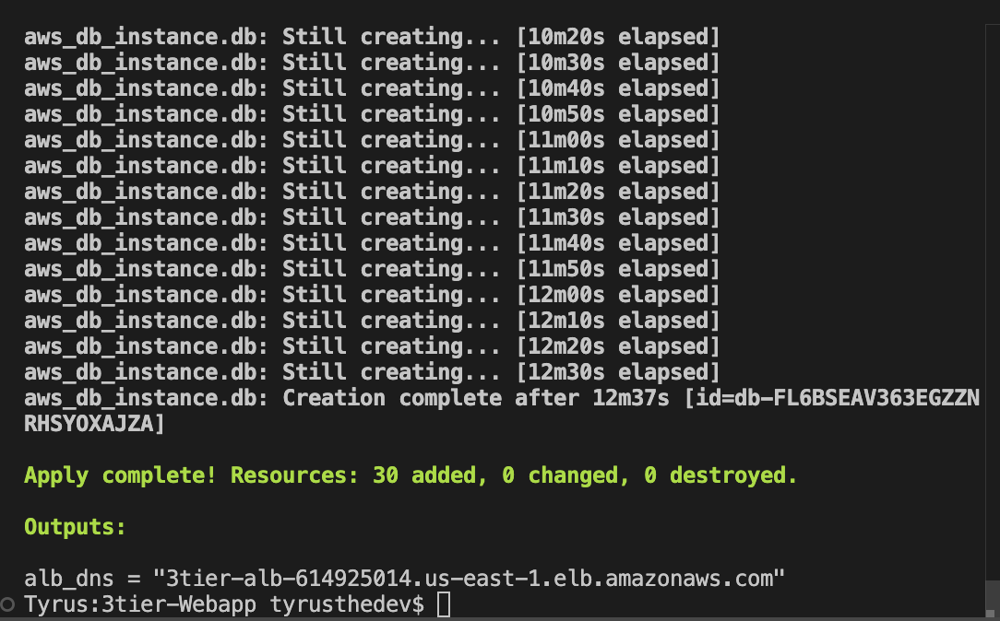
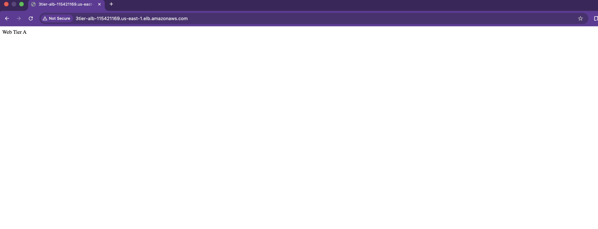

**What is shown:**  
Terraform provisions the entire architecture reproducibly.

Infrastructure can be recreated, modified, or destroyed using code.

---

🧠 What This Project Demonstrates
	•	VPC network design
	•	Multi-AZ architecture
	•	Public vs Private subnet routing
	•	NAT gateway configuration
	•	Load balancing
	•	Security group isolation
	•	RDS high availability
	•	Infrastructure as Code discipline
